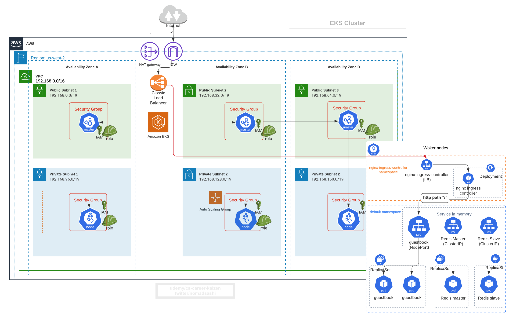
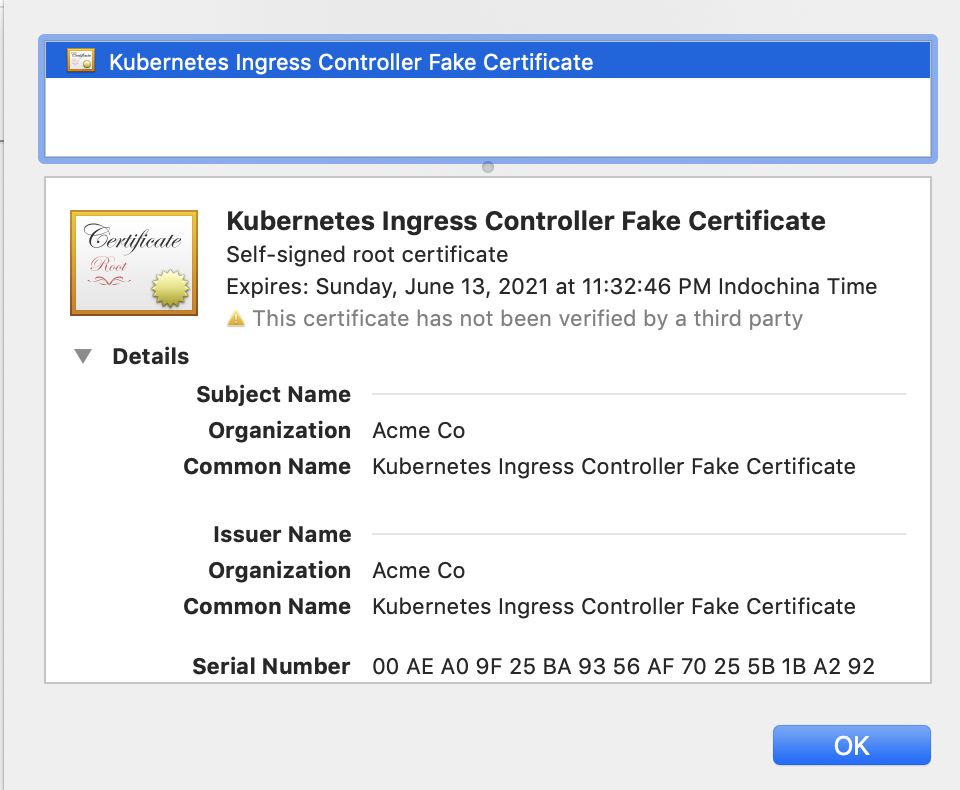
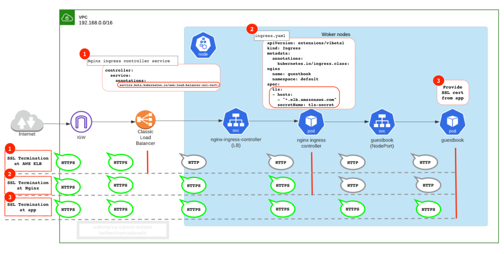
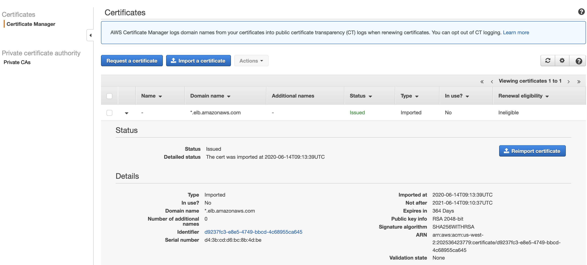
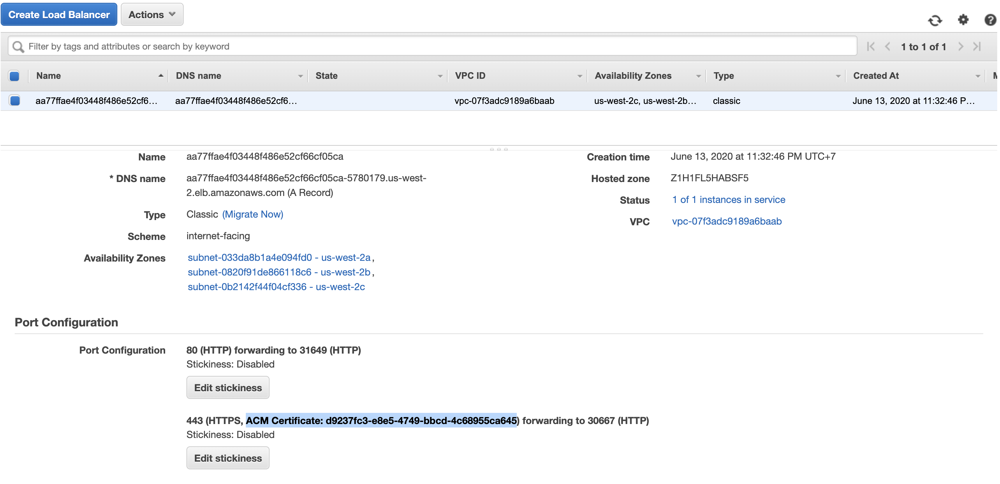
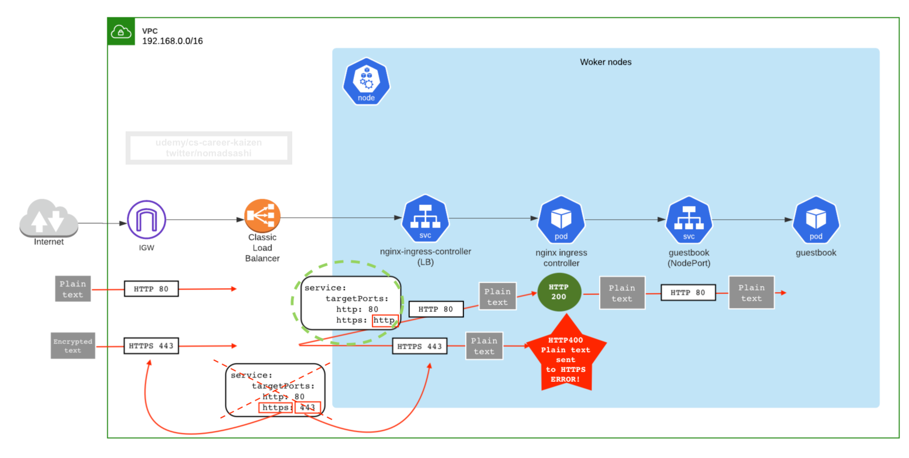
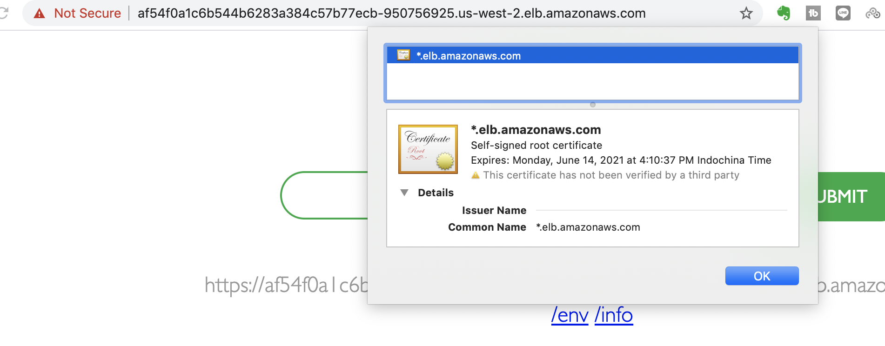
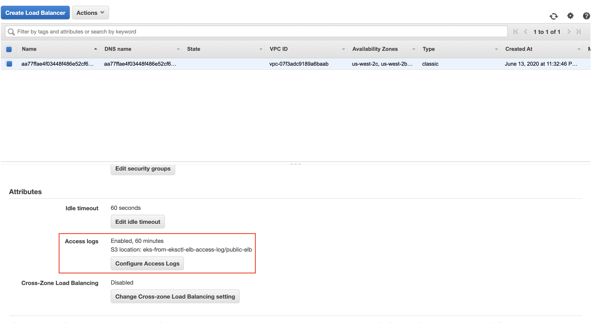
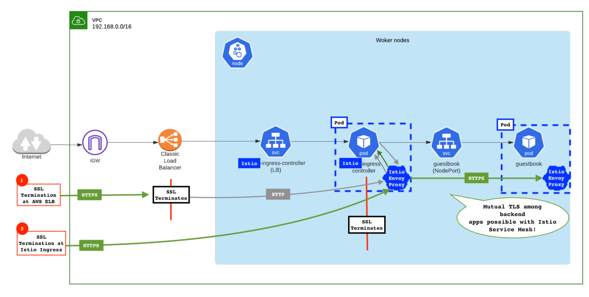

# 6. Networking: Ingress ControllerでPodを外部に公開

__注釈__:
このコースでは０から本番運用に向けてAWS EKSを学ぶために __nginx ingress controller__ を使ってAWS ELBを立ち上げますが、本番運用で最大のFlexibilityとFeatureを使いたい場合は、__istio gateway__ や __traefik__ をオススメします（要別のコース）


前のチャプターでは`guestbook` serviceを`LoadBalancer`タイプとして外部公開しました。

前回のチャプターでpods等削除された方は、サイド下記のコマンドで再作成してください
```
kubectl apply -f https://raw.githubusercontent.com/kubernetes/examples/master/guestbook-go/redis-master-controller.json

kubectl apply -f https://raw.githubusercontent.com/kubernetes/examples/master/guestbook-go/redis-master-service.json

kubectl apply -f https://raw.githubusercontent.com/kubernetes/examples/master/guestbook-go/redis-slave-controller.json

kubectl apply -f https://raw.githubusercontent.com/kubernetes/examples/master/guestbook-go/redis-slave-service.json

kubectl apply -f https://raw.githubusercontent.com/kubernetes/examples/master/guestbook-go/guestbook-controller.json

kubectl apply -f https://raw.githubusercontent.com/kubernetes/examples/master/guestbook-go/guestbook-service.json
```


まずは`guestbook` service を取得
```
kubectl get service guestbook
```

アウトプット
```
NAME        TYPE           CLUSTER-IP     EXTERNAL-IP                                                              PORT(S)          AGE
guestbook   LoadBalancer   10.100.36.45   a24ac71d1c2e046f59e46720494f5322-359345983.us-west-2.elb.amazonaws.com   3000:30604/TCP   39m
```

`LoadBalancer`Serviceタイプのデメリットは:
- レイヤー４のロードバランサー, つまりHTTPなどのレイヤー７を理解できない (例： httpパスやホスト).
- 1つのserviceで1つのロードバランサーを作成するのでコスパが悪い


そこで `INGRESS` K8s リソースの登場


# 6.1 NginxのIngress ControllerをHelm Chartを使ってインストール
Refs: 
- https://github.com/helm/charts/tree/master/stable/nginx-ingress
- https://kubernetes.github.io/ingress-nginx/deploy/
- https://github.com/kubernetes/ingress-nginx/tree/master/charts/ingress-nginx

```sh
kubectl create namespace nginx-ingress-controller

# stable/nginx-ingress is deprecated 
# helm install nginx-ingress-controller stable/nginx-ingress -n nginx-ingress-controller

# add new repo ingress-nginx/ingress-nginx
helm repo add ingress-nginx https://kubernetes.github.io/ingress-nginx
helm repo add stable https://charts.helm.sh/stable
helm repo update

# install
helm install nginx-ingress-controller ingress-nginx/ingress-nginx
```

アウトプット
```bash
NAME: nginx-ingress-controller
LAST DEPLOYED: Sat Jun 13 22:13:54 2020
NAMESPACE: nginx-ingress-controller
STATUS: deployed
REVISION: 1
TEST SUITE: None
NOTES:
The nginx-ingress controller has been installed.
It may take a few minutes for the LoadBalancer IP to be available.
You can watch the status by running 'kubectl --namespace nginx-ingress-controller get services -o wide -w nginx-ingress-controller-controller'

An example Ingress that makes use of the controller:

  apiVersion: extensions/v1beta1
  kind: Ingress
  metadata:
    annotations:
      kubernetes.io/ingress.class: nginx
    name: example
    namespace: foo
  spec:
    rules:
      - host: www.example.com
        http:
          paths:
            - backend:
                serviceName: exampleService
                servicePort: 80
              path: /
    # This section is only required if TLS is to be enabled for the Ingress
    tls:
        - hosts:
            - www.example.com
          secretName: example-tls

If TLS is enabled for the Ingress, a Secret containing the certificate and key must also be provided:

  apiVersion: v1
  kind: Secret
  metadata:
    name: example-tls
    namespace: foo
  data:
    tls.crt: <base64 encoded cert>
    tls.key: <base64 encoded key>
  type: kubernetes.io/tls
```

`nginx-ingress-controller` namespaceに作られたK8sリソースをチェック
```
kubectl get pod,svc,deploy -n nginx-ingress-controller
```

アウトプット
```bash
NAME                                                            READY   STATUS    RESTARTS   AGE
pod/nginx-ingress-controller-controller-767d5fd45d-pv7ck        1/1     Running   0          2m28s
pod/nginx-ingress-controller-default-backend-7db948667c-bktm9   1/1     Running   0          2m28s

NAME                                               TYPE           CLUSTER-IP      EXTERNAL-IP                                                               PORT(S)                      AGE
service/nginx-ingress-controller-controller        LoadBalancer   10.100.66.170   a588cbec4e4e34e1bbc1cc066f38e3e0-1988798789.us-west-2.elb.amazonaws.com   80:31381/TCP,443:30019/TCP   2m29s
service/nginx-ingress-controller-default-backend   ClusterIP      10.100.213.5    <none>                                                                    80/TCP                       2m29s

NAME                                       READY   UP-TO-DATE   AVAILABLE   AGE
nginx-ingress-controller-controller        1/1     1            1           32m
nginx-ingress-controller-default-backend   1/1     1            1           32m
```

`nginx-ingress-controller-controller` という `LoadBalancer`Serviceタイプが作られたのがわかる。これはレイヤー４のロードバランサーだが、 `nginx-ingress-controller-controller`Pod内でNginxがL7の負荷分散をする。


# 6.2 IngressリソースをYAMLで作成し、HTTPパスやホストによるL7ロードバランス

[ingress.yaml](ingress.yaml)
```yaml
apiVersion: extensions/v1beta1
  kind: Ingress
  metadata:
    annotations:
      kubernetes.io/ingress.class: nginx
    name: guestbook
    namespace: default
  spec:
    rules:
      - http:
          paths:
            - backend:
                serviceName: guestbook
                servicePort: 3000 
              path: /
```

アプライ
```bash
kubectl apply -f ingress.yaml
```

ロードバランサーのPublic DNSを`nginx-ingress-controller-controller` serviceを表示して取得
```bash
kubectl  get svc nginx-ingress-controller-controller -n nginx-ingress-controller | awk '{ print $4 }' | tail -1
```

アウトプット
```bash
# ブラウザーからアクセス
a588cbec4e4e34e1bbc1cc066f38e3e0-1988798789.us-west-2.elb.amazonaws.com
```


そして`guestbook` service を`LoadBalancer`から`NodePort`タイプへ変更.

まずは`guestbook` serviceにYAMLを表示
```bash
kubectl get svc guestbook -o yaml
```

アウトプット
```yaml
apiVersion: v1
kind: Service
metadata:
  annotations:
    kubectl.kubernetes.io/last-applied-configuration: |
      {"apiVersion":"v1","kind":"Service","metadata":{"annotations":{},"labels":{"app":"guestbook"},"name":"guestbook","namespace":"default"},"spec":{"ports":[{"port":3000,"targetPort":"http-server"}],"selector":{"app":"guestbook"},"type":"LoadBalancer"}}
  creationTimestamp: "2020-06-13T14:20:12Z"
  finalizers:
  - service.kubernetes.io/load-balancer-cleanup
  labels:
    app: guestbook
  name: guestbook
  namespace: default
  resourceVersion: "14757"
  selfLink: /api/v1/namespaces/default/services/guestbook
  uid: 24ac71d1-c2e0-46f5-9e46-720494f5322b
spec:
  clusterIP: 10.100.36.45
  externalTrafficPolicy: Cluster
  ports:
  - nodePort: 30604
    port: 3000
    protocol: TCP
    targetPort: http-server
  selector:
    app: guestbook
  sessionAffinity: None
  type: LoadBalancer
status:
  loadBalancer:
    ingress:
    - hostname: a24ac71d1c2e046f59e46720494f5322-359345983.us-west-2.elb.amazonaws.com
```

YAML内の`status`などのメタデータ情報を削除
[service_guestbook_nodeport.yaml](service_guestbook_nodeport.yaml)
```
apiVersion: v1
kind: Service
metadata:
  annotations:
  labels:
    app: guestbook
  name: guestbook
  namespace: default
spec:
  ports:
  - nodePort: 30605
    port: 3000
    protocol: TCP
    targetPort: http-server
  selector:
    app: guestbook
  type: NodePort
```

Serviceはアップデートができないので、一旦既存の`guestbook` serviceを削除
```bash
kubectl delete svc guestbook
```

新しいServiceを作成
```bash
kubectl apply -f service_guestbook_nodeport.yaml
```

`default` namespaceのServiceを表示
```bash
$ kubectl get svc

NAME           TYPE        CLUSTER-IP      EXTERNAL-IP   PORT(S)          AGE
guestbook      NodePort    10.100.53.19    <none>        3000:30605/TCP   20s
kubernetes     ClusterIP   10.100.0.1      <none>        443/TCP          3h38m
redis-master   ClusterIP   10.100.174.46   <none>        6379/TCP         77m
redis-slave    ClusterIP   10.100.103.40   <none>        6379/TCP         76m
```

ロードバランサーにアクセステスt
```bash
# visit the URL from browser
kubectl  get svc nginx-ingress-controller-controller -n nginx-ingress-controller | awk '{ print $4 }' | tail -1
```


# 6.3  図解でおさらい

1. `guestbook`の`LoadBalancer`Serviceタイプを`NodePort`へ変更
2. `guestbook` service の前に`nginx-ingress-controller`の`LoadBalancer`Serviceタイプを設置
3. `nginx-ingress-controller` podがL7負荷分散をする
4. これにより複数のServicesを1つのIngress Controller Serviceにバインドできる

__Ingressを使う前__


__Ingress導入後__



# 6.4 (BEST PRACTICE) AWS ELBのHTTPSを可能にする
ロードバランサーのDNSをHTTPsでアクセスすると, フェイクNginxサーティフィケートが表示される



これは`nginx-ingress-controller-controller` pod内の`/etc/nginx/nginx.conf`に定義されたフェイクCert
```sh
# Pod内のコンテナにShellで接続
kubectl exec -it nginx-ingress-controller-controller-767d5fd45d-q7cpw -n nginx-ingress-controller sh

# "ssl"キーワード検索を*.confにかける
$ grep -r "ssl" *.conf

nginx.conf:                     is_ssl_passthrough_enabled = false,
nginx.conf:             listen_ports = { ssl_proxy = "442", https = "443" },
nginx.conf:     ssl_certificate     /etc/ingress-controller/ssl/default-fake-certificate.pem; # <-- here fake cert
nginx.conf:     ssl_certificate_key /etc/ingress-controller/ssl/default-fake-certificate.pem;
```

これは図のケース２ [Nginx Ingress Controller podでSSLターミネーション]



AWS ELB (ケース1)でSSLをターミネーとするには, SSL certを作成しELBにAttachする必要がある。


## 1. Self-signed Server Certificateを作成 (1024 or 2048 bit long)

Refs: 
- https://kubernetes.github.io/ingress-nginx/user-guide/tls/#tls-secrets
- https://kubernetes.github.io/ingress-nginx/user-guide/tls/#tls-secretshttps://stackoverflow.com/questions/10175812/how-to-create-a-self-signed-certificate-with-openssl


今回何もドメインを保持していないので、self-signed certを作る。

```bash
# -x509: self signed certificateを作る
# -newkey rsa:2048: 新しいprivate keyのEncryptionアルゴリズムを定義
# -keyout: 新しい private keyの名前
# -out: Certificateの名前
# -days: サートの有効期限。デフォルトは30日
openssl req \
        -x509 \
        -newkey rsa:2048 \
        -keyout elb.amazonaws.com.key.pem \
        -out elb.amazonaws.com.cert.pem \
        -days 365 \
        -nodes \
        -subj '/CN=*.elb.amazonaws.com'
```

Certのコンテンツを表示
```sh
openssl x509 -in elb.amazonaws.com.cert.pem -text -noout
```

アウトプット
```
Certificate:
    Data:
        Version: 1 (0x0)
        Serial Number: 15293043281836592574 (0xd43bcdd6bc8b4dbe)
    Signature Algorithm: sha256WithRSAEncryption
        Issuer: CN=*.elb.amazonaws.com
        Validity
            Not Before: Jun 14 09:10:37 2020 GMT
            Not After : Jun 14 09:10:37 2021 GMT
        Subject: CN=*.elb.amazonaws.com
        Subject Public Key Info:
            Public Key Algorithm: rsaEncryption
                Public-Key: (2048 bit)
```

## 2. Server CertificateをAWS ACM (Amazon Certificate Manager)にインポート
Ref: https://docs.aws.amazon.com/acm/latest/userguide/import-certificate-api-cli.html

```bash
aws acm import-certificate \
  --certificate fileb://elb.amazonaws.com.cert.pem \
  --private-key fileb://elb.amazonaws.com.key.pem \
  --region us-west-2
```

Certicate ARN (Amazon Resource Name)が表示される
```
{
    "CertificateArn": "arn:aws:acm:us-west-2:xxxxxx:certificate/d9237fc3-e8e5-4749-bbcd-4c68955ca645"
}
```

新しいインポートされたCertがAWS ACMのコンソールで確認できる




## 3. AWS ACM ARNをNginx ingress controllerのservice annotationsに定義
Refs:
- https://kubernetes.io/docs/concepts/services-networking/service/#ssl-support-on-aws
- https://github.com/helm/charts/tree/master/stable/nginx-ingress

`YOUR_CERT_ARN` をCert ARNに変更 [nginx_helm_chart_overrides_ssl_termination_at_elb.yaml](nginx_helm_chart_overrides_ssl_termination_at_elb.yaml)
```yaml
controller:
  service:
    annotations:
      # https for AWS ELB. Ref: https://kubernetes.io/docs/concepts/services-networking/service/#ssl-support-on-aws
      service.beta.kubernetes.io/aws-load-balancer-ssl-cert: "YOUR_CERT_ARN"
      service.beta.kubernetes.io/aws-load-balancer-backend-protocol: "tcp" # backend pod doesn't speak HTTPS
      service.beta.kubernetes.io/aws-load-balancer-ssl-ports: "443" # unless ports specified, even port 80 will be SSL provided
    targetPorts:
      https: http # TSL Terminates at the ELB
  config:
    ssl-redirect: "false" # don't let https to AWS ELB -> http to Nginx redirect to -> https to Nginx
```

## 4. Nginx ingress controller のHelm chartをアップグレード
```bash
helm upgrade nginx-ingress-controller \
    ingress-nginx/ingress-nginx \
    -n nginx-ingress-controller \
    -f nginx_helm_chart_overrides_ssl_termination_at_elb.yaml
```

`nginx-ingress-controller`namespaceの`nginx-ingress-controller-controller` serviceにannotationが追加されているのをチェック
```sh
kubectl describe svc nginx-ingress-controller-controller -n nginx-ingress-controller
```

アウトプット
```sh
Name:                     nginx-ingress-controller-controller
Namespace:                nginx-ingress-controller
Labels:                   app=nginx-ingress
                          app.kubernetes.io/managed-by=Helm
                          chart=nginx-ingress-1.39.1
                          component=controller
                          heritage=Helm
                          release=nginx-ingress-controller
Annotations:              meta.helm.sh/release-name: nginx-ingress-controller
                          meta.helm.sh/release-namespace: nginx-ingress-controller
                          service.beta.kubernetes.io/aws-load-balancer-ssl-cert: arn:aws:acm:us-west-2:202536423779:certificate/d9237fc3-e8e5-4749-bbcd-4c68955ca645  # <--- added here
```

ロードバランサーをコンソールからチェック：AWS Console > EC2 > Load Balancer:



ブラウザーからアクセステスト
```bash
# ELBのDNSを取得
kubectl  get svc nginx-ingress-controller-controller -n nginx-ingress-controller | awk '{ print $4 }' | tail -1

# output
aa77ffae4f03448f486e52cf66cf05ca-5780179.us-west-2.elb.amazonaws.com
```

## 5. "400 Bad Request. The plain HTTP request was sent to HTTPS port"エラーの解消の仕方

Ref: Ref: https://github.com/kubernetes/ingress-nginx/issues/918#issuecomment-327849334


curlコマンドを使っても同じリスポンスが返ってくる 
```bash
curl https://aa77ffae4f03448f486e52cf66cf05ca-5780179.us-west-2.elb.amazonaws.com/ -v -k

# アウトプット 
< HTTP/1.1 400 Bad Request
< Content-Type: text/html
< Date: Sun, 14 Jun 2020 09:47:49 GMT
< Server: nginx/1.17.10
< Content-Length: 256
< Connection: keep-alive
< 
<html>
<head><title>400 The plain HTTP request was sent to HTTPS port</title></head>
```

これの理由は、 Nginx Ingress ControllerのServiceリソースで `controller.service.targetPorts.https=443` が定義されているから。 (https://github.com/helm/charts/tree/master/stable/nginx-ingress),

```sh
service:
    targetPorts:
      http: 80
      https: 443  # <--- インバウンドの HTTPsがバックエンドの４４３へ(Nginx Ingress Controller)
```




`YOUR_CERT_ARN` をCert ARNに変更 [nginx_helm_chart_overrides_ssl_termination_at_elb_redirect_http.yaml](nginx_helm_chart_overrides_ssl_termination_at_elb_redirect_http.yaml)
```yaml
controller:
  service:
    annotations:
      # https for AWS ELB. Ref: https://kubernetes.io/docs/concepts/services-networking/service/#ssl-support-on-aws
      service.beta.kubernetes.io/aws-load-balancer-ssl-cert: "YOUR_CERT_ARN"
      service.beta.kubernetes.io/aws-load-balancer-backend-protocol: "http" # backend pod doesn't speak HTTPS
      service.beta.kubernetes.io/aws-load-balancer-ssl-ports: "443" # SSLポートを定義
    targetPorts:
      https: http # SSL/HTTPSをバックエンドのHTTPへ
```

Nginx helm chartをoverride yamlと共にアップグレード
```
helm upgrade nginx-ingress-controller \
            ingress-nginx/ingress-nginx \
            -n nginx-ingress-controller \
            -f nginx_helm_chart_overrides_ssl_termination_at_elb_redirect_http.yaml
```

`nginx-ingress-controller` namespaceの`nginx-ingress-controller-controller` service にあるannotationが追加れているのをチェック
```sh
kubectl describe svc nginx-ingress-controller-controller -n nginx-ingress-controller
```

アウトプット
```sh
Name:                     nginx-ingress-controller-controller
Namespace:                nginx-ingress-controller
Labels:                   app=nginx-ingress
                          app.kubernetes.io/managed-by=Helm
                          chart=nginx-ingress-1.39.1
                          component=controller
                          heritage=Helm
                          release=nginx-ingress-controller
Annotations:              meta.helm.sh/release-name: nginx-ingress-controller
                          meta.helm.sh/release-namespace: nginx-ingress-controller
                          service.beta.kubernetes.io/aws-load-balancer-ssl-cert: arn:aws:acm:us-west-2:202536423779:certificate/d9237fc3-e8e5-4749-bbcd-4c68955ca645  # <--- added here
```
ようやくAWS ロードバランサーにアクセスして HTTP 200 codeが返ってくる




# 6.5 (BEST PRACTICE) Service annotationsからELBのアクセスログをEnable


1. アクセスログが保存されるS3 bucketをAWS コンソール上で作成
```bash
eks-from-eksctl-elb-access-log
```

2. S3 bucketポリシーを定義

Ref: https://docs.aws.amazon.com/elasticloadbalancing/latest/classic/enable-access-logs.html

`ELB_ACCOUNT_ID`, `YOUR_AWS_ACCOUNT_ID`, `BUCKET_NAME`, そして `PREFIX`を変更（[s3_bucket_policy_elb_access_log.json](s3_bucket_policy_elb_access_log.json)）
```json
{
  "Version": "2012-10-17",
  "Statement": [
    {
      "Effect": "Allow",
      "Principal": {
        "AWS": "arn:aws:iam::ELB_ACCOUNT_ID:root"
      },
      "Action": "s3:PutObject",
      "Resource": "arn:aws:s3:::BUCKET_NAME/PREFIX/AWSLogs/YOUR_AWS_ACCOUNT_ID/*"
    },
    {
      "Effect": "Allow",
      "Principal": {
        "Service": "delivery.logs.amazonaws.com"
      },
      "Action": "s3:PutObject",
      "Resource": "arn:aws:s3:::BUCKET_NAME/PREFIX/AWSLogs/YOUR_AWS_ACCOUNT_ID/*",
      "Condition": {
        "StringEquals": {
          "s3:x-amz-acl": "bucket-owner-full-control"
        }
      }
    },
    {
      "Effect": "Allow",
      "Principal": {
        "Service": "delivery.logs.amazonaws.com"
      },
      "Action": "s3:GetBucketAcl",
      "Resource": "arn:aws:s3:::BUCKET_NAME"
    }
  ]
}
```


3. `nginx-ingress-controller` serviceにService annotationsを追加

Ref: https://kubernetes.io/docs/concepts/services-networking/service/#elb-access-logs-on-aws

この4つのService annotationsをHelm ChartのOverrides.yamlに追加
```yaml
metadata:
      name: my-service
      annotations:
        service.beta.kubernetes.io/aws-load-balancer-access-log-enabled: "true"
        # access logsをON
        service.beta.kubernetes.io/aws-load-balancer-access-log-emit-interval: "60"
        # ログがプッシュされるインターバルは5分か60分
        service.beta.kubernetes.io/aws-load-balancer-access-log-s3-BUCKET_NAME: "my-bucket"
        # S3 bucketの名前
        service.beta.kubernetes.io/aws-load-balancer-access-log-s3-bucket-prefix: "my-bucket-prefix/prod"
        # S3 bucketのPrefix（フォルダー）
```


実際のYAMLの例（[nginx_helm_chart_overrides_access_logs.yaml](nginx_helm_chart_overrides_access_logs.yaml)）
```yaml
controller:
  service:
    annotations:
      # https for AWS ELB. Ref: https://kubernetes.io/docs/concepts/services-networking/service/#ssl-support-on-aws
      service.beta.kubernetes.io/aws-load-balancer-ssl-cert: "YOUR_CERT_ARN"
      service.beta.kubernetes.io/aws-load-balancer-backend-protocol: "http" # backend pod doesn't speak HTTPS
      service.beta.kubernetes.io/aws-load-balancer-ssl-ports: "443" # unless ports specified, even port 80 will be SSL provided
      # access logsをON
      service.beta.kubernetes.io/aws-load-balancer-access-log-enabled: "true"
      service.beta.kubernetes.io/aws-load-balancer-access-log-emit-interval: "60"  # ログがプッシュされるインターバルは5分か60分
      service.beta.kubernetes.io/aws-load-balancer-access-log-s3-BUCKET_NAME: "eks-from-eksctl-elb-access-log"
      service.beta.kubernetes.io/aws-load-balancer-access-log-s3-bucket-prefix: "public-elb"
    targetPorts:
      https: http # TSL Terminates at the ELB
```

4. Nginx ingress controller をHelm Chartからアップグレード
```sh
helm upgrade nginx-ingress-controller \
    ingress-nginx/ingress-nginx \
    -n nginx-ingress-controller \
    -f nginx_helm_chart_overrides_access_logs.yaml
```




## 図解でおさらい
__After Ingress__


# 6.6 無料版Nginx Ingress Controllerのデメリット

いくつかのNginx ingress controllersのデメリットが記事で残されています:
- [Painless Nginx](https://danielfm.me/posts/painless-nginx-ingress.html)
    - [Tuning Nginx](https://www.nginx.com/blog/tuning-nginx/)
- [Kubernetes Ingress Controllers: How to choose the right one: Part 1](https://itnext.io/kubernetes-ingress-controllers-how-to-choose-the-right-one-part-1-41d3554978d2)


例えば:
> Do not share Nginx Ingress for multiple environments

> Tuning Worker Process and Memory Settings


> Nginx config file got humongous and very slow to reload. POD IPs got stale and we started to see 5xx errors. Keep scaling up the same ingress controller deployment did not seem to solve the problem

つまり、複数の運用環境・チームが管理しているingress.yamlを1つのYAMLにまとめると、Nginxが全てをReloadする時間が長くなったり、メモリー消費量が異常に高くなることがある。


# 6.7 AWS ALB Ingress Controllerのデメリット

- [Kubernetes Ingress Controllers: How to choose the right one: Part 1](https://itnext.io/kubernetes-ingress-controllers-how-to-choose-the-right-one-part-1-41d3554978d2)

もし複数の運用環境・チームが、複数のingress.yamlを分散管理していた場合, ALB Ingress Controllerは最新のアプライされたIngress YAMLのみを反映させるので、Mergeができない。

> Require all the ingress resources to be defined in one place

つまり、Nginxの場合と異なり、複数の運用環境・チームが管理しているingress.yamlを1つのYAMLにまとめる必要がある


# 6.8 NginxやAWS ALB Ingress Controllerの HTTPS/TLSに関する限界(なぜIstio Service Meshがここで映えるのか) 
NginxやAWS ALB Ingress Controllerは共にSSL terminationに対応しているが、バックエンドのアプリ間のTLSはアプリ次第となっています。つまり 1) アプリ間でTLS certを提供し、2) CPUリソースを消費するSSL handshakesを行う必要があります。

もしIstioを使うと、アプリのコードを一切変更せずに、クラスター内でデフォルトでSSLを可能にし、且つService Mesh機能であるCanaryリリースやFault Injectionなどもできるようになります。


そんなIstioの新しいコースを現在作成中です。


# Helm コマンド
```bash
# get manifest and values from deployment
helm get manifest nginx-ingress-controller -n nginx-ingress-controller
helm get values nginx-ingress-controller -n nginx-ingress-controller
```